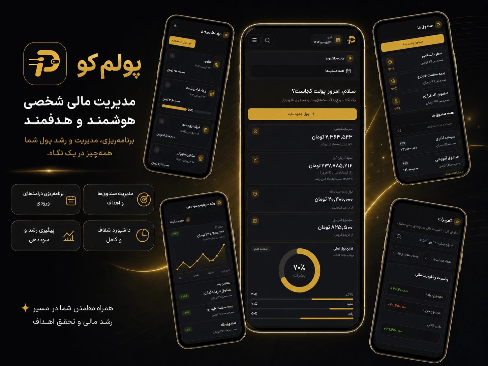
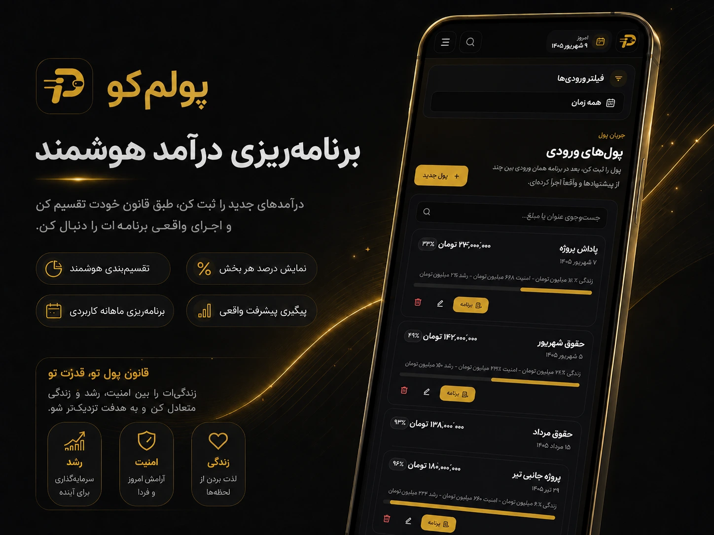
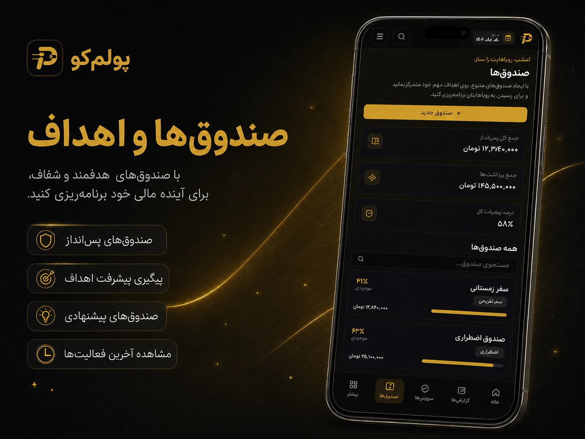
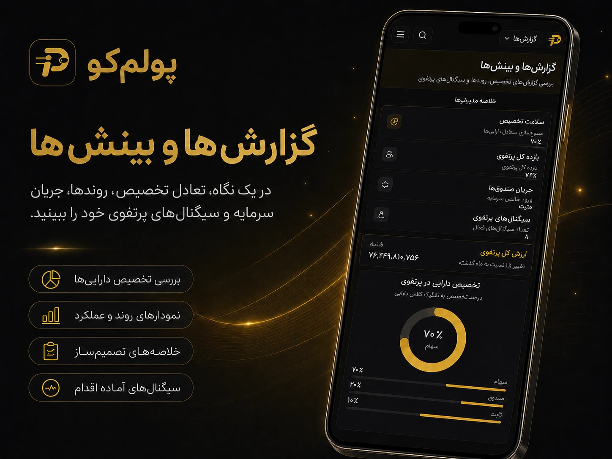
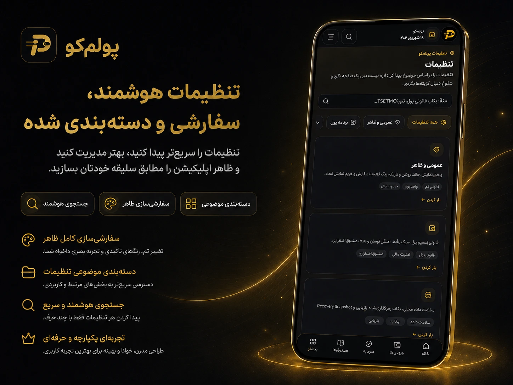
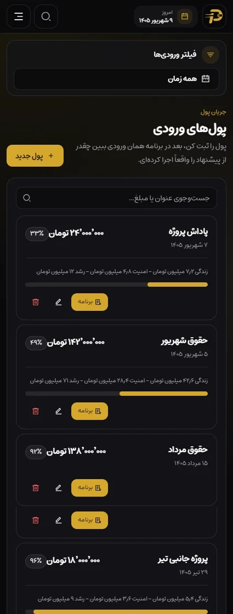
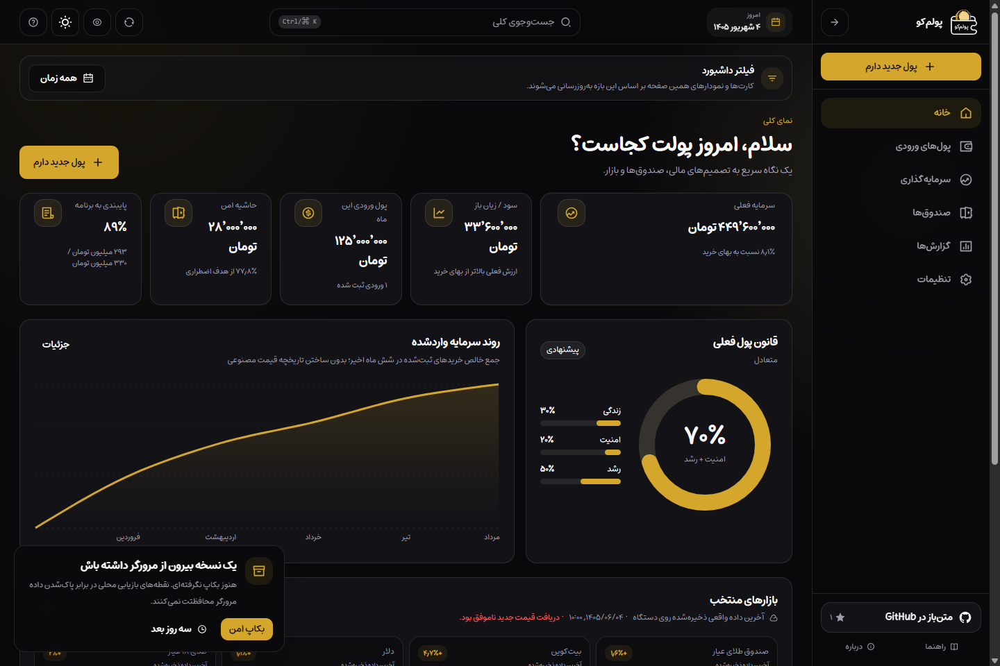

# پولم‌کو

### وب‌اپ فارسی، RTL، Local-First و PWA برای تصمیم‌گیری درباره پول‌های ورودی، صندوق‌ها و سرمایه‌گذاری

[English](./README.md) · [مستندات](./docs/README.md) · [امنیت](./SECURITY.md) · [مجوز](./LICENSE)

---

## وضعیت فعلی پروژه

- **آخرین نسخه پایدار:** [`v1.1.1`](./docs/releases/1.1.1.md)
- **قرارداد ماندگاری داده:** IndexedDB با **schema 8**
- **مرزهای اصلی محصول:** Local-first برای داده مالی، حساب کاربری سمت سرور، Analytics امن از نظر حریم خصوصی، و PWA برای Workspace
- **بهبودهای اخیر:** صف خرید سرمایه‌گذاری جمع‌وجورتر، رنگ‌های معنایی سود/زیان، فرمت نمایش عددهای مالی تمیزتر، و لندینگ پولیش‌شده‌تر

تاریخچه بلند Releaseها را از متن اصلی README بیرون نگه داشته‌ایم تا صفحه شلوغ نشود. اگر جزئیات نسخه‌ها را می‌خواهی، آن‌ها در [`docs/releases/`](./docs/releases/) ثبت شده‌اند.

## ویترین فارسی محصول

این تصاویر نسخه فارسی Presentation برای معرفی محصول هستند. این‌ها از هویت بصری تأییدشده و رفرنس‌های واقعی UI ساخته شده‌اند، اما **اسکرین‌شات دقیق Build نهایی نیستند** و عددهای داخل آن‌ها صرفاً نمایشی‌اند.

<p align="center">
  
</p>

<table>
  <tr>
    <td width="50%"></td>
    <td width="50%"></td>
  </tr>
  <tr>
    <td width="50%"></td>
    <td width="50%"></td>
  </tr>
</table>

README انگلیسی همچنان ویترین رسمی GitHub را با پنل‌های انگلیسی نشان می‌دهد. اسکرین‌شات‌های دقیق‌تر از محصول واقعی نیز در [`docs/assets/screenshots/`](./docs/assets/screenshots/) نگه داشته می‌شوند.

## پولم‌کو چیست؟

پولم‌کو یک ابزار حسابداری روزمره نیست. هدفش این است که وقتی پولی به دستت می‌رسد، سریع مشخص کنی چه مقدار برای زندگی، امنیت و رشد کنار گذاشته شود؛ بعد هم ثبت کنی واقعاً چقدر از آن برنامه را اجرا کرده‌ای.

هسته محصول بر این چرخه بنا شده است:

```text
پول ورودی
   ↓
برنامه تخصیص
   ↓
اجرای واقعی
   ↓
سبد و صندوق‌ها
   ↓
گزارش و بازخورد
```

داده‌های شخصی مالی در حالت عادی داخل مرورگر کاربر و در IndexedDB ذخیره می‌شوند. در نسخه دانشگاهی حساب کاربری سمت سرور لازم است، اما دیتابیس مرکزی شامل اطلاعات مالی کاربران وجود ندارد.

## مسیر وب‌سایت و برنامه

از نسخه 0.19، صفحه اصلی `/` یک Landing Page عمومی برای معرفی محصول است و برنامه Local-first از `/dashboard` شروع می‌شود. PWA نصب‌شده نیز مستقیماً داشبورد را باز می‌کند. تغییر مسیر، IndexedDB موجود را جابه‌جا یا پاک نمی‌کند چون داده مرورگر به Origin وابسته است، نه Path.

## قابلیت‌ها

### پول‌های ورودی و برنامه‌ریزی

- ثبت پول جدید با تاریخ شمسی و مبلغ فارسی
- قانون قابل تنظیم زندگی / امنیت / رشد
- پیشنهاد هوشمند با توجه به صندوق اضطراری
- تغییر درصدها برای هر پول ورودی بدون تغییر قانون اصلی
- اصلاح امن پول ورودی بدون پایین‌آوردن مبلغ از اجرای واقعی ثبت‌شده
- ساخت، ویرایش و حذف کارت‌های برنامه
- ثبت اجرای کامل یا جزئی هر کارت
- مقایسه برنامه با اجرای واقعی

### سرمایه‌گذاری

- دارایی‌های طلا، ارز، رمزارز، سهام/بورس، صندوق سرمایه‌گذاری و دارایی سفارشی
- ثبت خرید و فروش واقعی
- ورود دسته‌ای سوابق خرید و فروش از CSV با پیش‌نمایش و اعتبارسنجی
- جست‌وجو و اتصال سهام و صندوق‌های قابل معامله بورس مستقیم به TSETMC بدون API Key
- قیمت دستی پشتیبان برای نمادهای بورسی و قیمت دستی برای دارایی سفارشی
- اتصال خرید به برنامه پول ورودی
- میانگین قیمت خرید و Cost Basis
- ارزش فعلی و سود/زیان باز
- سهم هدف در برابر سهم واقعی سبد
- پیشنهاد استفاده از پول جدید برای نزدیک‌شدن به تخصیص هدف

### صندوق‌ها

- صندوق اضطراری
- هزینه‌های برنامه‌ریزی‌شده مانند درمان، سفر، بیمه و هدیه
- هدف، موجودی، موعد و درصد پیشرفت
- واریز و برداشت بدون تبدیل برنامه به حسابداری ریز روزانه

### بازار

- BrsApi برای ارز/طلا/رمزارز با cache کوتاه سرور؛ Tindex فقط fallback اختیاری Quoteهای اصلی
- جست‌وجو، قیمت و تاریخچه سهام/ETFهای جدید مستقیم از `cdn.tsetmc.com` بدون API Key
- نمایش شفاف `منبع داده: TSETMC` یا Provider واقعی در UI
- یک Market Store مشترک برای کل اپ
- دریافت اولیه یک‌باره و Refresh دستی
- نمایش Health هر Provider در Settings با Diagnostic قابل‌کپی و امن؛ بدون قیمت، نماد، نام دارایی، market id، مبلغ، متن خام سرویس یا Secret
- تداوم Refresh ناقص: Quote تازه همیشه اولویت دارد و فقط Quoteهای اصلی/نمادهای واقعاً درخواست‌شده می‌توانند از آخرین Snapshot واقعی همان مسیر پر شوند
- نمایش واضح Snapshot محلی در Dashboard، سبد، دیده‌بان و جزئیات بازار؛ هشدار محلی تا Quote تازه نرسد شرط را اجرا نمی‌کند
- ذخیره Snapshotهای واقعی روی دستگاه
- تاریخچه واقعی ۱ و ۳ ماهه TSETMC برای نمادهای بورسی؛ تاریخچه دلار/طلا با Tindex اختیاری
- نمودار خطی برای شاخص‌های عمومی و کندل واقعی برای نمادهای بورس؛ Snapshot محلی fallback است
- دیده‌بان بازار برای دنبال‌کردن سهام و ETFها قبل از خرید، با افزودن مستقیم نماد به سبد
- نمایش NAV و حباب قیمت فقط وقتی Provider فعال واقعاً NAV بدهد؛ آداپتر مستقیم قیمت TSETMC مقدار NAV ساختگی تولید نمی‌کند
- هشدار قیمت، رشد/افت روزانه و فاصله از NAV با جلوگیری از اعلان تکراری
- هشدارهای محلی بازار؛ Background Push آزمایشی فعلاً در Backlog و در Build عادی غیرفعال است
- عدم تولید داده تاریخی مصنوعی

### گزارش‌ها

- کل پول‌های ورودی و پایبندی به برنامه
- جمع‌بندی تصمیمی اجرای برنامه، تعادل قانون پول و پوشش فعلی صندوق‌ها
- نمایش صریح تخصیص ناقص به‌جای جایگزین‌کردن داده خالی با درصدهای قانون
- پیگیری‌های بعدی فقط بر اساس داده ثبت‌شده محلی
- بازده واقعی خریدهای ثبت‌شده
- سهم فعلی در برابر سهم هدف
- نمودارهای مبتنی بر داده واقعی محلی
- حالت Privacy برای مخفی کردن اعداد مالی

### ماندگاری داده و بکاپ

- وضعیت آخرین بکاپ و هشدار واضح برای بکاپ قدیمی یا انجام‌نشده
- یادآوری دوستانه بعد از استفاده معنادار و تکرار پس از ۷ روز
- دانلود بکاپ رمزنگاری‌شده AES-GCM با Toast و Error Handling کامل
- فرمت Backup v2 با SHA-256 برای تشخیص خرابی فایل و Metadata نسخه برنامه/Schema
- بررسی سازگاری و Preview رکوردها قبل از Restore؛ فایل‌های قدیمی v1 همچنان قابل خواندن‌اند
- حداکثر ۵ Recovery Snapshot محلی برای برگشت از حذف یا Restore اشتباه
- Snapshot خودکار روزانه و Snapshot قبل از عملیات تخریبی مهم
- نمایش وضعیت Persistent/Best-effort مرورگر با تأکید اینکه Browser Storage بکاپ دائمی نیست
- متادیتای بکاپ و Recovery history فقط روی همان دستگاه باقی می‌مانند و وارد فایل خروجی نمی‌شوند
- انتقال مستقیم رمزنگاری‌شده بین دو دستگاه با WebRTC، کد Pairing قابل Copy/Share و Preview قبل از Import
- ساخت Recovery Snapshot قبل از جایگزینی داده دستگاه مقصد و Backup فایل رمزدار به‌عنوان fallback عمومی
- جلوگیری از Import داده Backup/Recovery/Transfer با Schema جدیدتر تا قبل از هر جایگزینی تخریبی
- بررسی سلامت داده بین Ledgerها و لینک‌های محلی، بدون ارسال داده به سرور؛ ترمیم خودکار فقط برای خلاصه‌های محاسباتی قطعی و پس از Recovery Snapshot

### متن‌باز، راهنما و اعتماد

- لینک مستقیم GitHub و نمایش تعداد Star با Cache و بدون نیاز به GitHub token در استفاده معمول
- صفحات عمومی راهنما، درباره پروژه، سیاست داده و ماندگاری/بازیابی داده
- صفحه عمومی Analytics برای توضیح دقیق داده‌های اندازه‌گیری‌شده و مرزهای حریم خصوصی
- لینک گزارش مشکل، Security و MIT License
- حمایت مالی کاملاً اختیاری و بدون قفل‌کردن هیچ قابلیت
- یادآوری حمایت فقط بعد از حداقل ۷ روز استفاده واقعی با cooldown طولانی

### Analytics اختیاری

- Cloudflare Web Analytics فقط در Production و فقط با توکن صریح مالک استقرار
- بدون dependency تحلیلی npm و بدون Custom Event مالی
- اندازه‌گیری Visits، Page Views و Core Web Vitals برای فهم استفاده و کیفیت تجربه
- بدون ارسال مبلغ، موجودی، نام دارایی شخصی، تراکنش، Search، فرم یا محتوای Backup
- بدون توکن، هیچ Beacon تحلیلی خارجی Render نمی‌شود

### Landing Page و پایداری Production

- Landing Page فارسی و عمومی در `/` برای معرفی روشن محصول قبل از ورود اطلاعات مالی
- ورود به اپ از `/dashboard` و PWA start URL هماهنگ با همان مسیر
- `robots.txt`، `sitemap.xml` و `noindex` برای جداکردن صفحات عمومی از routeهای مالی
- صفحه خطای عمومی، 404 و خطای route با مسیر بازیابی بدون پیشنهاد Reset مخرب
- تشخیص خطا/Timeout در آماده‌شدن IndexedDB به‌جای Skeleton بی‌پایان
- Banner وضعیت Offline با تأکید بر در‌دسترس‌بودن داده محلی
- Skip link برای دسترسی بهتر با کیبورد
- اعلان صریح نسخه جدید PWA؛ Service Worker منتظر فقط بعد از تأیید کاربر فعال می‌شود
- محافظت از Upgrade دیتابیس بین چند تب و توقف تب قدیمی قبل از ادامه Live Queryهای مالی

### تجربه کاربری

- فارسی و RTL از پایه
- PWA و Offline shell
- Responsive و Mobile-first با رعایت Safe Area برای ناوبری ثابت
- دسترسی یک‌ضربه‌ای موبایل به خانه، ورودی‌ها، سرمایه‌گذاری و صندوق‌ها
- Sidebar جمع‌شونده در دسکتاپ با اعلام Route فعال برای فناوری کمکی
- جست‌وجوی کلی قابل کنترل با کیبورد در بخش‌ها، ورودی‌ها، صندوق‌ها و دارایی‌ها
- Light / Dark / System theme
- پالت طلایی پیش‌فرض
- راهنمای اولیه محصول با امکان رد کردن سریع راه‌اندازی
- ورود موجودی دارایی‌های قبلی با تاریخ و میانگین قیمت خرید
- Tooltipهای توضیحی برای مفاهیم مالی
- Skeletonهای متناسب با ساختار واقعی صفحه و shimmer ملایم
- انیمیشن CSS سبک با `tailwindcss-animated` برای ورود stagger آیتم‌ها، navigation و Toast با رعایت `prefers-reduced-motion`

## لایه چندحسابی نسخه دانشگاهی

نسخه پروژه دانشگاهی حساب و Session را در پایگاه داده سمت سرور نگه می‌دارد، اما اطلاعات مالی همچنان در IndexedDB مرورگر باقی می‌مانند. راه‌اندازی و معماری در [`docs/academic-auth.md`](./docs/academic-auth.md) توضیح داده شده است.

## Local-First و حریم خصوصی

اطلاعات اصلی پولم‌کو در IndexedDB همان مرورگر و Origin نگهداری می‌شوند. به‌صورت پیش‌فرض دیتابیس مرکزی شامل اطلاعات مالی کاربران وجود ندارد.

این مدل چند پیامد مهم دارد:

- حساب سروری فقط برای هویت و تفکیک کاربران استفاده می‌شود و داده مالی همچنان محلی است.
- داده‌های مالی اصلی روی دستگاه کاربر باقی می‌مانند.
- پاک کردن Site Data می‌تواند اطلاعات محلی را حذف کند.
- Private Browsing محل مناسبی برای نگهداری اطلاعات دائمی نیست.
- Backup منظم برای استفاده واقعی ضروری است.

برای جزئیات بیشتر [SECURITY.md](./SECURITY.md) را ببین.

## تکنولوژی‌ها

- Next.js 16 + App Router
- React 19 + TypeScript
- Tailwind CSS 4
- shadcn/ui و کامپوننت‌های PersianLabs UI برای تجربه فارسی
- Dexie + IndexedDB
- React Hook Form + Zod
- TanStack Table
- Recharts و Lightweight Charts در بخش‌های لازم
- next-themes
- `tailwindcss-animated` برای micro-interactionهای CSS و stagger آیتم‌به‌آیتم Workspace
- `motion` برای revealهای viewport/scroll در بخش‌هایی که زمان ورود به دید کاربر مهم است
- Cloudflare Web Analytics به‌صورت اختیاری و بدون SDK تحلیلی
- Remix Icons از طریق react-icons

## ساختار پروژه

```text
app/            routeها، layoutها و API routeها
components/     UI، shell، chartها و feature componentها
hooks/          منطق قابل استفاده مجدد و stateهای featureها
lib/            مدل داده، محاسبات، validation، database و market adapters
public/         PWA assets، service worker و آیکون‌ها
docs/           معماری، تاریخچه فازها و راهنمای انتشار
scripts/        quality gates و بررسی معماری UI
tests/          تست‌های واحد منطق مالی
```

## اجرای محلی

### نیازمندی‌ها

- Node.js 22.x
- npm
- Git

### نصب

```bash
npm install
cp .env.example .env.local
npm run dev
```

Landing Page به‌صورت پیش‌فرض روی `http://localhost:3000` و خود برنامه روی `http://localhost:3000/dashboard` اجرا می‌شود.

## داده بازار

برای نرخ‌های عمومی فقط `BRS_API_KEY` لازم است. **TSETMC مستقیم برای بورس API Key نمی‌خواهد.** `TINDEX_API_TOKEN` در v0.34 همچنان اختیاری است و فقط برای اتصال‌های قدیمی، fallback آهسته نرخ‌های پایه و تاریخچه آنلاین دلار/طلا استفاده می‌شود. خطاهای Provider به وضعیت‌های امن و قابل‌فهم تبدیل می‌شوند و متن خام پاسخ سرویس بیرونی نمایش داده نمی‌شود. نام دقیق متغیرها در `.env.example` آمده است.

در فرم دارایی، نمادهایی مثل «عیار»، «سیمین»، «فولاد» یا «شستا» مستقیماً روی `cdn.tsetmc.com` جست‌وجو می‌شوند. قیمت‌های بورس به ریال برمی‌گردند و پولم‌کو در Route سمت سرور آن‌ها را به تومان تبدیل می‌کند. Quoteهای TSETMC حدود ۴۵ ثانیه و تاریخچه یک ساعت cache می‌شوند؛ BrsApi هم cache کوتاه ۶۰ ثانیه‌ای دارد تا چند کاربر سهمیه Provider را بی‌دلیل مصرف نکنند.

اگر TSETMC یا BrsApi موقتاً در دسترس نباشد، پولم‌کو داده ساختگی تولید نمی‌کند: آخرین Snapshot واقعی IndexedDB و سپس قیمت دستی fallback هستند. رکوردهای قدیمی با `source: tindex` حذف نمی‌شوند؛ برای کاهش وابستگی به سهمیه Tindex می‌توانی آن‌ها را هر زمان از ویرایش دارایی دوباره با TSETMC لینک کنی.

## Analytics رایگان و Privacy-first

پولم‌کو از نسخه 0.18 امکان اتصال اختیاری به Cloudflare Web Analytics را دارد. برای فعال‌سازی، سایت را در Cloudflare Web Analytics اضافه کن، Token موجود در Snippet را بردار و فقط در Environment مربوط به Production قرار بده:

```env
NEXT_PUBLIC_CLOUDFLARE_WEB_ANALYTICS_TOKEN=your_site_token
```

این مقدار Secret حساب Cloudflare نیست؛ Site Token عمومی است که در Beacon مرورگر قرار می‌گیرد. اگر متغیر خالی باشد، هیچ Analytics script خارجی Render نمی‌شود. محیط Development هم حتی با وجود توکن اندازه‌گیری نمی‌شود.

Cloudflare Web Analytics آمار کلی مثل Visits، Page Views، مسیر صفحه، Device/Browser و Core Web Vitals را جمع می‌کند. پولم‌کو هیچ Custom Event برای مبلغ‌ها، تراکنش‌ها، دارایی‌های شخصی، جست‌وجو، فرم‌ها، Backup یا انتقال دستگاه نمی‌سازد. برای جزئیات و Setup کامل: [docs/analytics.md](./docs/analytics.md).

## هشدارهای بازار و Background Push

هشدارهای محلی بازار بدون Backend کار می‌کنند و هنگام اجرای اپ با Refresh قیمت‌ها بررسی می‌شوند. آزمایش Background Web Push نسخه v0.13.0 از v0.13.1 **عمداً در Backlog قرار گرفته و در Build عادی غیرفعال است** تا پروژه رایگان، Local-First و بدون Redis/Cron اجباری باقی بماند. برای Deploy معمول هیچ VAPID key، Upstash یا `CRON_SECRET` لازم نیست.

کد آزمایشی حذف نشده است؛ جزئیات فنی و روش فعال‌سازی فقط برای توسعه آینده در [docs/backlog/background-push.md](./docs/backlog/background-push.md) نگهداری می‌شود. فاز Analytics رایگان در v0.18 و Landing/Production Hardening در v0.19 تکمیل شده‌اند؛ مراحل بعدی در [docs/ROADMAP.md](./docs/ROADMAP.md) ثبت می‌شوند.

## Quality Gate

قبل از Commit، Gate معمول را اجرا کن:

```bash
npm run check
npm run build
```

برای Release Stable، Gate کامل Production و metadata نهایی را اجرا کن:

```bash
npm run check:stable
```

`check:stable` ابتدا کل مسیر `check:release` را اجرا می‌کند و بعد هم‌ترازی Version/Schema/Docs نسخه Stable جاری (`v1.1.1`) و Guardrailهای Launch را می‌سنجد. Gate Production یک Build می‌سازد و همان Build را در Profile موقت Chrome/Edge/Chromium برای migration واقعی schema 6→8، Landing → Workspace، آنبوردینگ/داده محلی، راهنمای سریع، Reports و مرزهای PWA تست می‌کند. Playwright/Cypress اضافه نشده است. اگر مرورگر خودکار پیدا نشد، `POOLAMKOO_BROWSER_PATH` را تنظیم کن.


## تصویر محصول در لندینگ

Hero عمومی حالا یک ترکیب سینمایی جمع‌وجور را دور **اسکرین‌شات واقعی موبایل Poolamkoo** می‌سازد. خود اسکرین‌شات از دیتای نمایشی ساخته شده و در هر دو حالت Light/Dark همان نمای واقعی محصول را نشان می‌دهد؛ بنابراین لندینگ برای معرفی قابلیت‌ها به تصویر مفهومی وابسته نیست.

<p align="center"></p>

این Capture از Profile عادی مرورگر یا داده مالی شخصی چیزی نمی‌خواند.

## اسکرین‌شات‌های محصول

برای ساخت تصاویر GitHub از **Build واقعی Poolamkoo** با یک Browser Profile موقت و دیتای کاملاً نمایشی اجرا کن:

```bash
npm run media:capture
```

اگر Build تازه از قبل وجود دارد:

```bash
npm run media:capture:built
```

خروجی داخل `docs/assets/screenshots/` قرار می‌گیرد. در GitHub هم Workflow دستی **Product media** همین کار را انجام می‌دهد و Artifact با نام `poolamkoo-product-screenshots` می‌سازد. Capture به Profile واقعی مرورگر یا داده مالی واقعی دسترسی نمی‌گیرد. جزئیات کامل در [docs/assets/README.md](./docs/assets/README.md) است.

مسیرهای README برای همین خروجی‌ها آماده‌اند؛ بعد از Capture و Commit تصاویر تأییدشده، GitHub محیط واقعی برنامه با Fixture نمایشی را اینجا نشان می‌دهد:

<p align="center">
  
</p>

<table>
  <tr>
    <td width="50%"></td>
    <td width="50%"></td>
  </tr>
  <tr>
    <td width="50%"></td>
    <td width="50%"></td>
  </tr>
  <tr>
    <td width="50%"></td>
    <td width="50%"></td>
  </tr>
  <tr>
    <td colspan="2" align="center"></td>
  </tr>
</table>

## PWA

پولم‌کو Manifest، Service Worker، Offline route، آیکون‌های نصب و Favicon دارد. برای QA انتشار، نصب واقعی PWA روی موبایل و دسکتاپ را هم تست کن؛ DevTools به‌تنهایی جای تست نصب واقعی را نمی‌گیرد.

چک‌لیست کامل در [docs/testing/release.md](./docs/testing/release.md) قرار دارد.

## مستندات

از [docs/README.md](./docs/README.md) شروع کن. مستندات معماری، مراحل توسعه و Release Notes در پوشه `docs/` نگهداری می‌شوند تا README به معرفی پایدار محصول محدود بماند.

## امنیت

اگر مشکل امنیتی پیدا کردی، آن را به‌صورت عمومی همراه با اطلاعات حساس منتشر نکن. راهنمای گزارش در [SECURITY.md](./SECURITY.md) آمده است.

## مشارکت و حمایت

سورس پروژه در [GitHub](https://github.com/hamedtkd/poolamkoo) عمومی است. گزارش باگ و پیشنهاد UX از مسیر Issues خوش‌آمد است. حمایت اختیاری از توسعه در [Daramet](https://daramet.com/hamedtkd) امکان‌پذیر است و هیچ قابلیت اضافه‌ای را باز نمی‌کند.

## مجوز

این پروژه تحت شرایط فایل [LICENSE](./LICENSE) منتشر می‌شود.

### انتقال مستقیم دستگاه

در Settings می‌توان داده مالی را بدون Backend مالی و بدون آپلود در دیتابیس مرکزی مستقیماً به دستگاه دیگر منتقل کرد. Pairing با کد قابل Copy/Share انجام می‌شود، Payload با رمز یک‌بارمصرف AES-GCM رمزنگاری می‌شود، گیرنده قبل از Import پیش‌نمایش رکوردها را می‌بیند و پیش از جایگزینی داده یک Recovery Snapshot ساخته می‌شود. برای جزئیات: [docs/device-transfer.md](./docs/device-transfer.md).

### v0.37 — چرخه امن آرشیو دارایی

آرشیو دارایی حالا قابل‌بازگشت و محافظت‌شده است: دارایی دارای موجودی باز یا برنامه مالی انجام‌نشده آرشیو نمی‌شود، دارایی‌های آرشیوشده با Recovery Snapshot قابل بازگردانی‌اند و رکوردهای قدیمیِ آرشیوشده که هنوز موجودی دارند تا زمان بازگردانی از ارزش سبد حذف نمی‌شوند. IndexedDB همچنان schema 7 است.
### v0.38 — دفتر گردش قابل‌ممیزی صندوق

موجودی صندوق‌ها حالا تاریخچه مستقل محلی دارد. واریز/برداشت دستی با تاریخ و یادداشت ثبت می‌شود و اصلاح یا حذف فقط وقتی پذیرفته می‌شود که replay زمانی هیچ‌گاه موجودی منفی نسازد؛ اجرای برنامه، کنارگذاری مستقیم پول جدید و برگشت حذف ورودی نیز از همین مسیر عبور می‌کنند. موجودی مثبت نسخه‌های قدیمی هنگام ارتقا به schema 8 به یک گردش آغازین تبدیل می‌شود.
