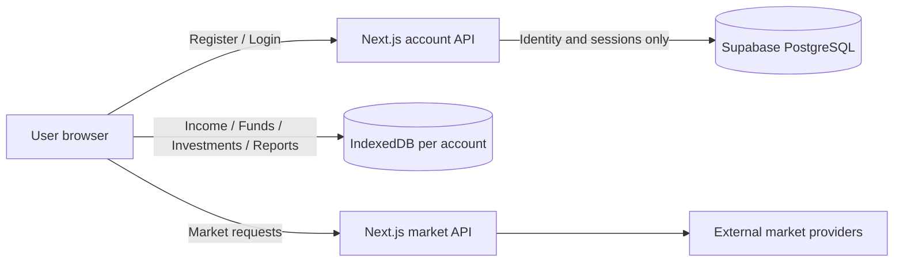

# University project scope — Poolamkoo

**Suggested title:** طراحی و پیاده‌سازی سامانه تحت وب مدیریت و برنامه‌ریزی مالی شخصی

## Requirement mapping

| University requirement | Poolamkoo implementation |
| --- | --- |
| Web application | Next.js / React responsive PWA |
| Small server database | Supabase PostgreSQL tables `app_users` and `app_sessions` |
| Multiple user accounts | Register, login, logout, editable profiles/passwords and independent account identities |
| Add / edit / delete records | Financial records in IndexedDB (income, funds, transactions, plans, assets) |
| Search and filters | Global search, investment/fund/activity filtering and date ranges |
| Queries | IndexedDB/Dexie queries for financial data plus server queries for user/session identity |
| Reporting | Reports, charts, allocation analysis, portfolio and fund summaries |
| External APIs | Market price providers and Tehran exchange data adapters |

## Privacy-aware split database design

The design intentionally avoids uploading financial records to the account database. The server-side database exists to satisfy multi-account identity and session requirements while the original local-first privacy model remains intact.

## Server database entities

### app_users
- `id`
- `email`
- `display_name`
- `password_hash`
- `created_at`
- `updated_at`

### app_sessions
- `id`
- `user_id`
- `token_hash`
- `expires_at`
- `created_at`

## Demo flow

1. Register two different accounts and demonstrate editing the display name and changing a password.
2. Log in as the first account and enter sample financial data.
3. Log out and log in as the second account; verify the first user's local records are not visible.
4. Show create/edit/delete/search/report workflows.
5. Show Supabase account rows to demonstrate the server-side database.
6. Explain that server rows contain identity/session data only, while financial tables remain in per-account IndexedDB.

## Offline-first workspace and purchase-level investment analytics

The university build now extends the local-first model in two directions without moving financial records to the server.

### Offline workspace behavior

After an authenticated account has opened the workspace online, the service worker warms the primary workspace documents and keeps them in an account-scoped runtime cache. When connectivity is lost, the user can still open the main financial pages and continue local financial work against that account's IndexedDB database, including income, funds, investments, activity and reports.

The offline boundary remains explicit:

- owned quantity, historical transactions, purchase cost, local reports and new local entries remain available;
- live market requests, new login/registration and server-side account/security actions require connectivity;
- cached market snapshots may be displayed as stale snapshots, but missing current prices are not replaced with fabricated market values;
- cached workspace documents are isolated by the authenticated account scope and are cleared when that server account signs out or is deleted.

### Purchase lots, FIFO and profit/loss

Every investment buy is now preserved as a separate purchase lot. Sells are matched to open lots using FIFO (oldest purchase first). This makes it possible to present both the portfolio average and the result of each historical purchase independently.

For every lot the product can report:

- original quantity and purchase cost;
- remaining quantity after partial sells;
- realized cost, realized proceeds and realized profit/loss;
- current value and unrealized profit/loss when a current/manual/snapshot price exists;
- the lot's individual return percentage.

Optional transaction fee and other cost fields are included in the real buy cost and net sell proceeds. The investment report also separates:

- historical money invested vs. historical sale proceeds;
- current open cost vs. current priced value;
- realized vs. unrealized profit/loss;
- allocation by purchase cost vs. allocation by current priced value;
- asset-level performance vs. purchase-level performance.

No new Supabase table and no new IndexedDB store are required for this upgrade. The optional fee fields are additive properties on existing transaction records, and lot analytics are derived from the existing transaction ledger at read time.
