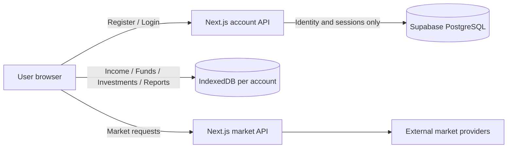

# University project scope — Poolamkoo

**Suggested title:** طراحی و پیاده‌سازی سامانه تحت وب مدیریت و برنامه‌ریزی مالی شخصی

## Requirement mapping

| University requirement | Poolamkoo implementation |
| --- | --- |
| Web application | Next.js / React responsive PWA |
| Small server database | Supabase PostgreSQL tables `app_users` and `app_sessions` |
| Multiple user accounts | Register, login, logout and independent account identities |
| Add / edit / delete records | Financial records in IndexedDB (income, funds, transactions, plans, assets) |
| Search and filters | Global search, investment/fund/activity filtering and date ranges |
| Queries | IndexedDB/Dexie queries for financial data plus server queries for user/session identity |
| Reporting | Reports, charts, allocation analysis, portfolio and fund summaries |
| External APIs | Market price providers and Tehran exchange data adapters |

## Privacy-aware split database design

The design intentionally avoids uploading financial records to the account database. The server-side database exists to satisfy multi-account identity and session requirements while the original local-first privacy model remains intact.

## Server database entities

### app_users
- `id`
- `email`
- `display_name`
- `password_hash`
- `created_at`
- `updated_at`

### app_sessions
- `id`
- `user_id`
- `token_hash`
- `expires_at`
- `created_at`

## Demo flow

1. Register two different accounts.
2. Log in as the first account and enter sample financial data.
3. Log out and log in as the second account; verify the first user's local records are not visible.
4. Show create/edit/delete/search/report workflows.
5. Show Supabase account rows to demonstrate the server-side database.
6. Explain that server rows contain identity/session data only, while financial tables remain in per-account IndexedDB.
